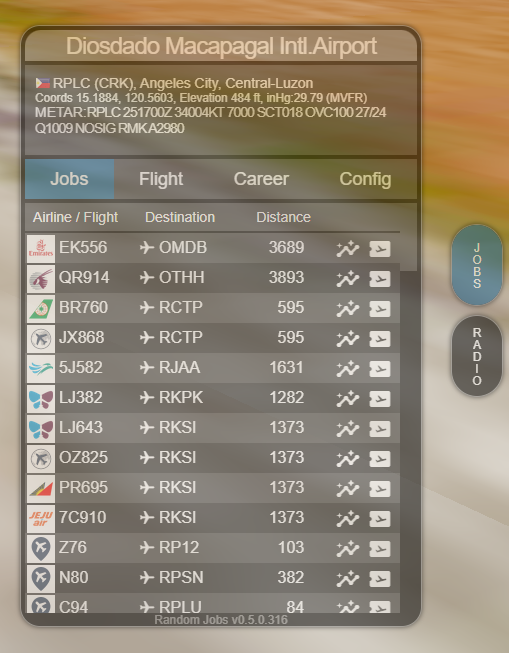
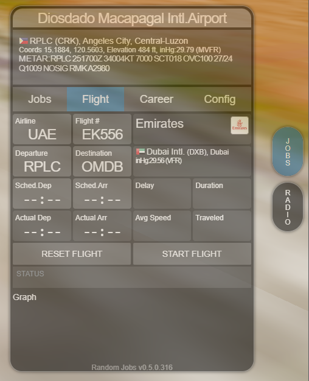

# Random Jobs for GeoFS

This mod adds random transport jobs and a basic career mode to the game.

TESTING VERSION: v0.5 only partial functionality yet.
- generating jobs
- displaying basic airport and airline info

## Please report bugs in the discord or on Github!

## Features (wip)
- creates jobs at airports to chose from and accept (done)
- basic career for earning virtual currency
- basic flight status tracking (manual) 

## Planned
- Fuel usage / management
- Licenses / Airplane ownership / leasing
- Multiplayer (Airplane market, FBOs, player made jobs, etc)

## Installation
- get [Tampermonkey](https://www.tampermonkey.net/)
- install [userscript](https://github.com/scitor/GeoFS/raw/master/randomJobs/randomJobs.user.js)

## Dependencies / Addons
- [MetarCache](https://github.com/scitor/GeoFS/raw/master/metarCache/metarCache.user.js) adds METAR weather data (fixes METAR:INOP)
